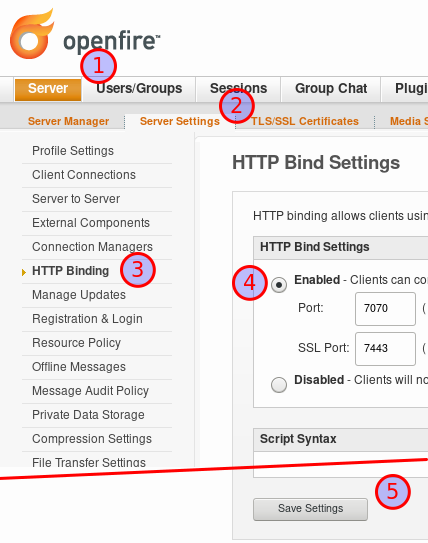
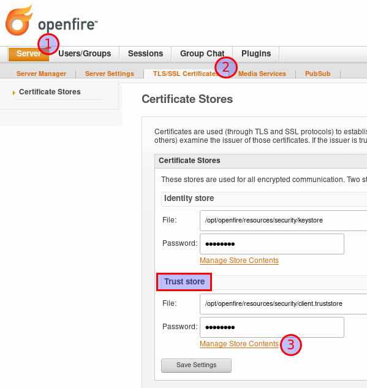
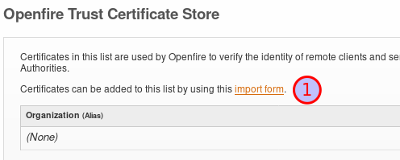
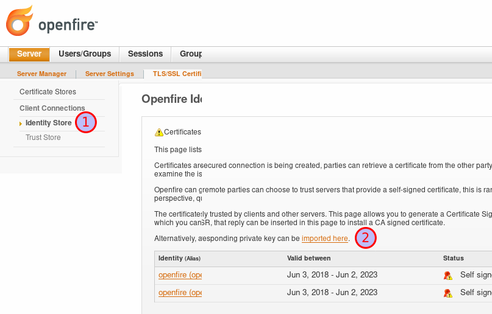
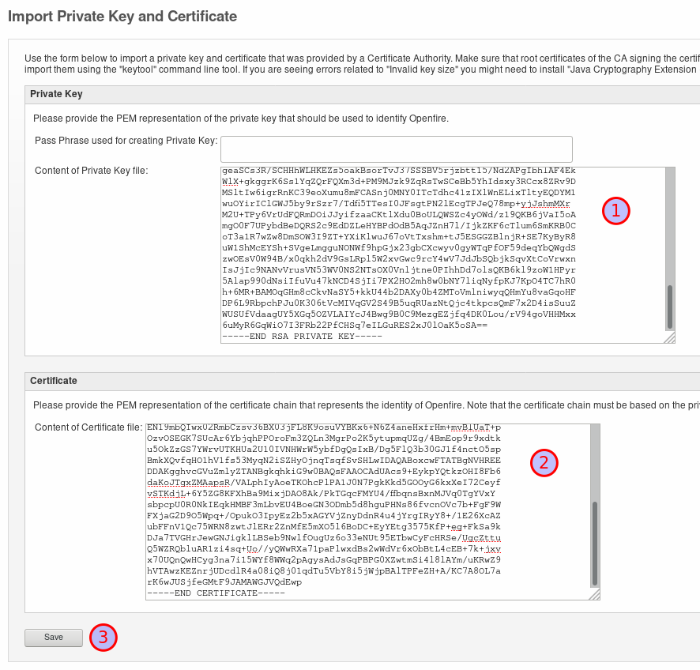
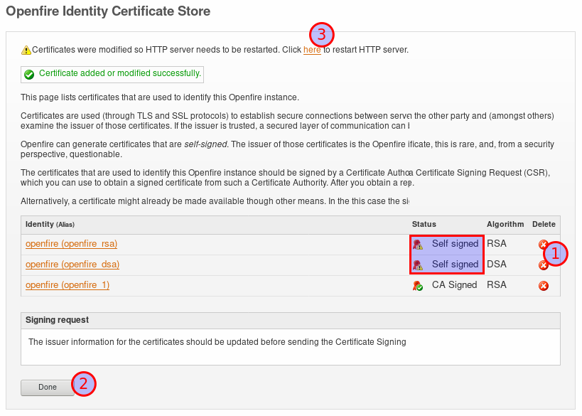
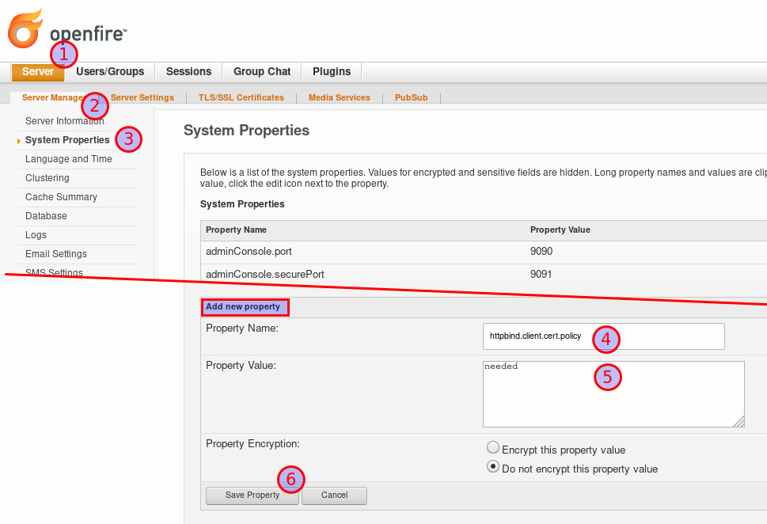
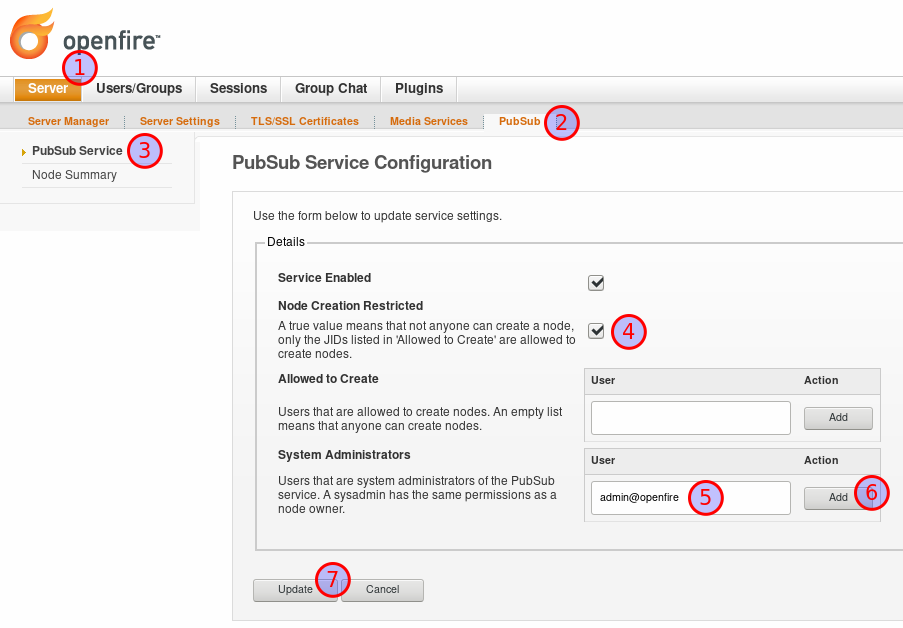

= Tutorial setup with Openfire and nginx
:toc:

This tutorial guides you through the setup of an XMPP-Grid Broker with an Openfire XMPP server and nginx web server.

After this tutorial, your setup will look like the this:

.Deployment Diagram of the finished XMPP-Grid Broker setup
image::tutorial-resources/depoyment_diagram.svg[Deployment Diagram, width=300px]

== Requirements

This guide assumes you are using Linux or macOS with the `openssl` binary installed.

Also, we assume you have installed and configured http://download.igniterealtime.org/openfire/docs/latest/documentation/install-guide.html[Openfire] and https://www.nginx.com/resources/wiki/start/topics/tutorials/install/[nginx]. In this tutorial, we use the following hostnames. You can replace the hostnames and ports to suit your needs.

|===
| Application | Hostname

|nginx server |`xgb.localhost.redbackup.org`
|Openfire server |`openfire`
|===

This guide assumes `admin` as Openfire administration user. It will be used by the XMPP-Grid Broker to configure the XMPP server.

== Generate certificates

To get started, we need 3 TLS certificates for the following instances:

* Host `openfire`
* Host `xgb.localhost.redbackup.org`
* Client certificate for the user `admin`
** With the `xmppAddr` set to `admin@openfire` (as specified in https://tools.ietf.org/html/rfc6120[RFC 6120])

We will use a custom certification authority (CA) to sign these certificates. For that purpose, you can use a script which generates the custom CA and all required certificates in this repository.

To generate the certificates run following steps:

[source, bash]
----
git clone git@github.com:xmpp-grid-broker/xmpp-grid-broker.git
cd xmpp-grid-broker/stack/certs
rm -r keys # # <1>
./generate.bash
----
<1> This removes all development certificates.

In this tutorial, we refer to this certificate folder as `certs/`.

If you would like to customise the certificate and CA configuration, you can do so by editing the files in `conf`. Note that the script generates additional certificates which are not used in this tutorial.

== Setup Openfire

Go to the Openfire administration interface, in our example setup https://openfire:9091/, and modify configuration as described in the following screenshots.

=== Enable BOSH

<1> Go to _Server_
<2> Go to _Server Settings_
<3> Go to _HTTP Binding_
<4> Enable the HTTP Binding
<5> Save Settings

=== Configure Certification Authority

<1> Go to _Server_
<2> Go to _TLS/SSL Certificates_
<3> Go to _Manage Store Contents_ of the *Trust store*

<1> Go to _import form_

image::tutorial-resources/openfire_truststore_add.png[Import Certifcate in Trustore Detail, role="thumb", width=500px]
<1> Add a name for the CA certificate
<2> Copy the content from `certs/keys/ca-fullchain.pem` in the _Content of Certificate file_ textbox
<3> _Save_

=== Configure Server TLS Certificates

<1> Go to _Identity Store_
<2> Go to _imported here_

<1> Copy the content from `certs/keys/host/openfire/privkey.pem` in the _Content of Private Key file_ textbox
<2> Copy the content from `certs/keys/host/openfire/fullchain.pem` in the _Content of Certificate file_ textbox
<3> _Save_

<1> Remove all old _Self signed_ Certificates with the according delete icon
<2> Confirm with _Done_
<3> Restart the openfire web server with a click on _here_

=== Require Client Certificate in HTTP Binding

<1> Go to _Server_
<2> Go To _Server Manager_
<3> Go to _System Properties_
<4> Insert `httpbind.client.cert.policy` as new _Property Name_
<5> Insert `needed` as new _Property Value_
<6> _Save Property_

=== Configure PubSub Administrator

<1> Go to _Server_
<2> Go to _PubSub_
<3> Go to _PubSub Service_
<4> Activate _Node Creation Restricted_ to prohibit unauthorised Topic creation.
<5> Insert `admin@openfire` as new _System Administartors_ -> _User_ name
<6> Confirm new Administrator with _Add_
<7> `Update` the Configuration

== Setup nginx

The first step is to copy the certificates from `certs/keys/host`, `certs/keys/client` as well as the CA public key from `certs/keys/ca-fullchain.pem` to the folder `/etc/certs` on your nginx server.

Secondly, add following configuration to your nginx setup, for example in `/etc/nginx/conf.d/xmpp-grid-broker.conf`.

[source]
----
upstream openfire {
    server openfire:7443 fail_timeout=0;
}

server {
    listen 80;
    server_name xgb.localhost.redbackup.org;
    return 301 https://$host$request_uri;
}

server {
    listen 443 ssl http2;
    server_name xgb.localhost.redbackup.org;

    ssl_certificate /etc/certs/host/xgb.localhost.redbackup.org/fullchain.pem;
    ssl_certificate_key /etc/certs/host/xgb.localhost.redbackup.org/privkey.pem;

    ssl_verify_client on;
    ssl_client_certificate /etc/certs/ca-fullchain.pem;

    access_log /var/log/nginx/${host}.access.log;
    error_log /var/log/nginx/${host}.error.log info;

    keepalive_timeout 6000;

    # support up to ~20MB uploads
    client_max_body_size 20M;

    # security headers <1>
    add_header Strict-Transport-Security max-age=15768000;
    add_header Content-Security-Policy "default-src 'none'; script-src 'self' 'unsafe-inline'; connect-src 'self'; img-src 'self' data:; style-src 'self' 'unsafe-inline';" always;
    add_header 'Access-Control-Allow-Origin' 'xgb.localhost.redbackup.org' always;
    add_header 'Access-Control-Allow-Methods' 'GET, PUT, POST, DELETE, HEAD, OPTIONS' always;

    # Openfire BOSH
    location /http-bind {
        if ($request_method = 'OPTIONS') {
            add_header 'Content-Type' 'text/plain; charset=utf-8';
            add_header 'Content-Length' 0;
            return 204;
        }
        proxy_set_header Host openfire;
        proxy_set_header X-Forwarded-Host openfire;
        proxy_set_header X-Forwarded-Server openfire;
        proxy_set_header X-Real-IP $remote_addr;
        proxy_set_header X-Forwarded-For $proxy_add_x_forwarded_for;

        proxy_hide_header 'Content-Security-Policy';
        proxy_hide_header 'Access-Control-Allow-Origin';
        proxy_hide_header 'Access-Control-Allow-Methods';

        proxy_ssl_certificate /etc/certs/client/admin@openfire/fullchain.pem;
        proxy_ssl_certificate_key /etc/certs/client/admin@openfire/privkey.pem;
        proxy_ssl_trusted_certificate /etc/certs/ca-fullchain.pem;
        proxy_ssl_verify on;
        proxy_ssl_session_reuse on;
        proxy_request_buffering off;
        proxy_buffering off;

        proxy_pass https://openfire/http-bind;
        break;
    }
    location / {
      root /var/www/xgb.localhost.redbackup.org/;
      try_files $uri $uri/ /index.html
      break;
    }
}
----
<1> See link:docs/SECURITY.md[Security Recommendations]

== Setup XMPP-Grid Broker

Add the https://github.com/xmpp-grid-broker/xmpp-grid-broker/releases[latest XMPP-Grid Broker release] on the nginx server in the web root folder under `/var/www/xgb.localhost.redbackup.org/`.

Create the configuration file `configuration.json` also in the web root folder `/var/www/xgb.localhost.redbackup.org/` with the following content:

[source, json]
----
{
  "xmpp": {
    "server":     "openfire",
    "transport":  "bosh",
    "boshURL":    "https://xgb.localhost.redbackup.org/http-bind"
  }
}
----

All configuration options are documented in the link:INSTALL.md#Configuration[expert installation guide].

== That's it!

To finish the XMPP-Grid Broker setup, restart nginx.

Next, add the CA and client certificate from `certs/keys/ca-fullchain.pem` and `certs/keys/client/admin@openfire/admin@openfire.p12` to your browser.  In Firefox, you can do this in the Preferences under `Privacy & Security` -> `View-Certificates` in the tab `Your Certificates` (client certificate) and `Authorities` (CA) respectively.

The XMPP-Grid Broker application is now available under https://xgb.localhost.redbackup.org/.
