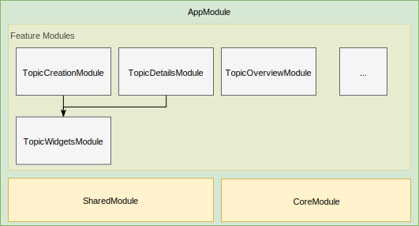

== Frontend Structure

We must establish a clean architectural structure to keep the frontend maintainable.

=== Considered Options

* Monolyth: All components and services in a single module to support fast-prototyping
* Module-Based: Hierarchical Module-Structure, grouping related components.

=== Decision Outcome

We decided on the module-based option as it follows software engineering best practices for long-lived projects.
We accept a slower starting phase to benefit in the long-term from a clean architecture.

Following the https://angular.io/guide/styleguide[Angular Style Guide], we decided on two primary modules: `core`, `shared` as well as additional widget and
feature modules.

Each module can have submodules to refine the structure even further.

Because the current scope is rather small, all modules are loaded eagerly.

The `core` module contains the XMPP connection setup, authentication and other functionality that is required at all times.

The `shared` module contains simple components that do not depend on any services but are just plain components used to render common structures, e.g. buttons.

